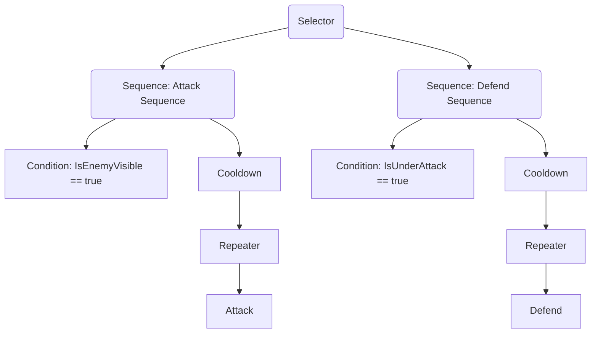

# GroveGames Behaviour Tree

A modular and extensible behavior tree framework for AI development in C# for the .NET and Godot Engine. This system allows for the creation of complex AI behaviors by combining various `Node`, `Composite`, and `Decorator` components.

## Table of Contents
- [Overview](#overview)
- [Features](#features)
- [Installation](#installation)
- [Getting Started](#getting-started)
  - [Creating a Behavior Tree](#creating-a-behavior-tree)
  - [Example Diagram](#example-diagram)
- [Usage Example in Godot](#usage-example-in-godot)
- [Customization](#customization)
- [Contributing](#contributing)
- [License](#license)

## Overview

This behavior tree framework enables AI agents to make decisions and perform actions based on conditions in a dynamic environment. Use this setup to build intelligent game characters with modular and reusable nodes.

## Features

- **Modular Nodes**: Includes `Selector`, `Sequence`, `Decorator`, and custom action nodes.
- **Blackboard System**: A shared data space for AI agents to store and retrieve contextual information.
- **Godot Integration**: Works seamlessly within Godot using the node structure.
- **Extensibility**: Easily add new node types and custom behaviors.

## Installation

Install the package via .NET CLI:

```bash
dotnet add package GroveGames.BehaviourTree
```

For Godot:

```bash
dotnet add package GroveGames.BehaviourTree.Godot
```

## Getting Started

### Creating a Behavior Tree

To set up a behavior tree, create a class that inherits from `Tree` and override the `SetupTree` method to define the AI structure.

Here's an example of a `CharacterBT` class that builds an AI behavior tree:

```csharp
public class CharacterBT : Tree
{
    public CharacterBT(GroveGames.BehaviourTree.Nodes.Root root) : base(root) { }

    public override void SetupTree()
    {
        var selector = Root.Selector();
        
        var attackSequence =  selector.Sequence();
        attackSequence.Attach(new Condition(() => IsEnemyVisible()));

        attackSequence
        .Cooldown(1f)
        .Repeater(RepeatMode.UntilSuccess)
        .Attach(new Attack(attackSequence));

        var defendSequence = selector.Sequence()
        defendSequence.Attach(new Condition(() => IsUnderAttack()));
        defendSequence
        .Cooldown(1f)
        .Repeater(RepeatMode.UntilSuccess)
        .Attach(new Defend(defenceSequence));
    }
}
```

### Example Diagram

## Usage Example in Godot

Below is a full example of setting up and using the behavior tree in a Godot scene:

```csharp
public partial class TestSceneController : Godot.Node
{
    [Export] Node3D _enemy;
    [Export] Node3D _entity;

    private CharacterBT _characterBT;

    public override void _Ready()
    {
        _characterBT = new CharacterBT(new Root(new Blackboard()));
        _characterBT.SetEntity(_entity, _enemy);
        _characterBT.SetupTree();
    }

    public override void _Process(double delta)
    {
        _characterBT.Tick((float)delta);
    }

    public override void _Input(InputEvent @event)
    {
        if (@event.IsPressed())
        {
            _characterBT.Abort(); // Aborts the current tree
        }
    }
}
```

### Explanation

- **Ready Method**: Initializes the behavior tree and assigns entities (e.g., player and enemy).
- **Process Method**: Ticks the behavior tree every frame to update actions based on elapsed time.
- **Input Method**: Allows manual interruption of the behavior tree, useful for testing or player-triggered events.

## Customization

Extend the framework with new functionality by creating custom nodes:

- **Action Nodes**: Inherit from `Node` and implement specific behaviors in `Evaluate`.
- **Decorator Nodes**: Inherit from `Decorator` and modify the behavior of a single child node.
- **Composite Nodes**: Inherit from `Composite` and define logic for multiple child nodes.
- **Blackboard**: Use the blackboard to share data between nodes. For example, store target information or flags.

### Example: Custom Decorator (Delayer)

This `Delayer` decorator delays the execution of a child node by a specified amount of time:

```csharp
public class Delayer : Decorator
{
    private readonly float _waitTime;
    private float _interval;

    public Delayer(IParent parent, float waitTime) : base(parent)
    {
        _waitTime = waitTime;
    }

    public override NodeState Evaluate(float deltaTime)
    {
        _interval += deltaTime;

        if (_interval >= _waitTime)
        {
            _interval = 0f;
            return base.Evaluate(deltaTime);
        }
        else
        {
            return NodeState.Running;
        }
    }

    public override void Reset()
    {
        _interval = 0f;
    }
}
```

This decorator only allows the child node to execute once the specified wait time has passed.

## Contributing

Contributions are welcome! To contribute:
1. Fork the repository.
2. Create a new branch (`git checkout -b feature/YourFeature`).
3. Commit your changes (`git commit -am 'Add new feature'`).
4. Push the branch (`git push origin feature/YourFeature`).
5. Open a Pull Request.

## License

This project is licensed under the MIT License - see the [LICENSE](LICENSE) file for details.
