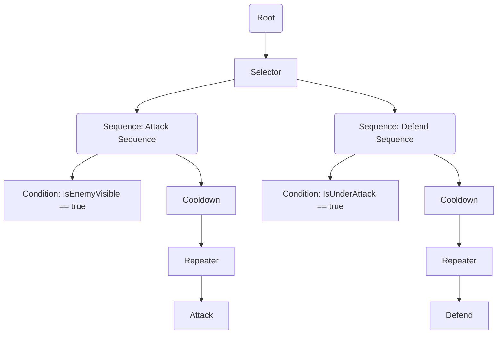
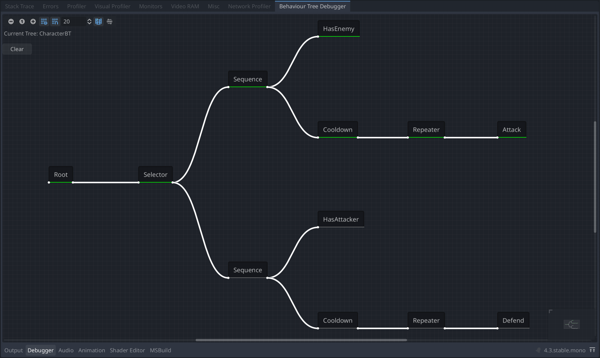

# GroveGames Behaviour Tree

[](https://github.com/grovegs/BehaviourTree/actions/workflows/release.yml)
[](https://github.com/grovegs/BehaviourTree/actions/workflows/tests.yml)
[](https://github.com/grovegs/BehaviourTree/releases/latest)
[](https://www.nuget.org/packages/GroveGames.BehaviourTree)

A modular and extensible behavior tree framework for AI development in C# for the .NET and Godot Engine. This system allows for the creation of complex AI behaviors by combining various `Node`, `Composite`, and `Decorator` components.

## Table of Contents
- [Overview](#overview)
- [Features](#features)
- [Installation](#installation)
- [Getting Started](#getting-started)
  - [Creating a Behavior Tree](#creating-a-behavior-tree)
  - [Example Diagram](#example-diagram)
  - [Example Nodes](#example-nodes)
  - [Example Tree](#example-tree)
  - [Debugging](#debugging)
- [Usage Example in Godot](#usage-example-in-godot)
- [Customization](#customization)
- [Contributing](#contributing)
- [License](#license)

## Overview

This behavior tree framework enables AI agents to make decisions and perform actions based on conditions in a dynamic environment. Use this setup to build intelligent game characters with modular and reusable nodes.

## Features

- **Modular Nodes**: Includes `Selector`, `Sequence`, `Decorator`, and custom action nodes.
- **Blackboard System**: A shared data space for AI agents to store and retrieve contextual information.
- **Godot Integration**: Works seamlessly within Godot using the node structure.
- **Extensibility**: Easily add new node types and custom behaviors.

## Installation

Install the package via .NET CLI:

```bash
dotnet add package GroveGames.BehaviourTree
```

For Godot:

```bash
dotnet add package GroveGames.BehaviourTree.Godot
```

## Getting Started

### Creating a Behavior Tree

To set up a behavior tree, create a class that inherits from `Tree` and override the `SetupTree` method to define the AI structure.

### Example Diagram


### Example Nodes

#### Attack

```csharp
public class Attack : Node
{
    public Attack(IParent parent) : base(parent) {}

    public override NodeState Evaluate(float delta)
    {
        Console.WriteLine("Attacking");
        return NodeState.Running;
    }
}
```

#### Defend

```csharp
public class Defend : Node
{
    public Defend(IParent parent) : base(parent) {}

    public override NodeState Evaluate(float delta)
    {
        Console.WriteLine("Defending");
        return NodeState.Running;
    }
}
```

### Example Tree
Here's an example of a `CharacterBT` class that builds an AI behavior tree:
```csharp
public class CharacterBT : Tree
{
    public CharacterBT(GroveGames.BehaviourTree.Nodes.Root root) : base(root) { }

    public override void SetupTree()
    {
        var selector = Root.Selector();
        
        var attackSequence = selector.Sequence();
        attackSequence.Attach(new Condition(() => IsEnemyVisible()));
        attackSequence
        .Cooldown(1f)
        .Repeater(RepeatMode.UntilSuccess)
        .Attach(new Attack(attackSequence));

        var defendSequence = selector.Sequence()
        defendSequence.Attach(new Condition(() => IsUnderAttack()));
        defendSequence
        .Cooldown(1f)
        .Repeater(RepeatMode.UntilSuccess)
        .Attach(new Defend(defendSequence));
    }
}
```

### Debugging

To assist with testing and debugging behavior trees, GroveGames Behaviour Tree includes a **Visual Debugger** that helps track the current state of each node in real-time.

1. **Enable Visual Debugger**: To use the debugger, ensure your behavior tree class derives from `GodotBehaviourTree`. After instantiating your behavior tree, call the `SetRoot` method and pass in a new `Root` node to initialize the tree structure. Additionally, remember to call the `Enable` method to activate debugging. Here’s an example:

    ```csharp
    public override void _Ready()
    {
        _characterBT = new CharacterBT();
        _characterBT.SetRoot(new Root(new Blackboard()));
        _characterBT.SetupTree();
        _characterBT.Enable();
        AddChild(_characterBT);
    }
    ```

2. **Node State Tracking**: Once enabled, you can observe states such as `Running`, `Success`, or `Failure` for each node. This is especially useful for visualizing sequences, conditions, and actions that may fail or succeed based on game conditions.

3. **Godot Integration**: With debugging enabled, information about node states will be displayed under the **Debugger** tab, allowing you to track the AI behavior tree’s state updates frame-by-frame.

#### Example Visual Tree
Below is an example of how a behavior tree appears in the visual debugger, showing nodes and their states during runtime.



## Usage Example in Godot

Below is a full example of setting up and using the behavior tree in a Godot scene:

```csharp
public partial class Character : Godot.Node
{
    private CharacterBT _characterBT;

    public override void _Ready()
    {
        _characterBT = new CharacterBT(new Root(new Blackboard()));
        _characterBT.SetupTree();
    }

    public override void _Process(double delta)
    {
        _characterBT.Tick((float)delta);
    }

    public override void _Input(InputEvent @event)
    {
        if (@event.IsPressed())
        {
            _characterBT.Abort(); // Aborts the current tree
        }
    }
}
```

## Customization

Extend the framework with new functionality by creating custom nodes:

- **Action Nodes**: Inherit from `Node` and implement specific behaviors in `Evaluate`.
- **Decorator Nodes**: Inherit from `Decorator` and modify the behavior of a single child node.
- **Composite Nodes**: Inherit from `Composite` and define logic for multiple child nodes.
- **Blackboard**: Use the blackboard to share data between nodes. For example, store target information or flags.

### Example: Custom Decorator (Delayer)

This `Delayer` decorator delays the execution of a child node by a specified amount of time:

```csharp
public class Delayer : Decorator
{
    private readonly float _waitTime;
    private float _interval;

    public Delayer(IParent parent, float waitTime) : base(parent)
    {
        _waitTime = waitTime;
    }

    public override NodeState Evaluate(float deltaTime)
    {
        _interval += deltaTime;

        if (_interval >= _waitTime)
        {
            _interval = 0f;
            return base.Evaluate(deltaTime);
        }
        else
        {
            return NodeState.Running;
        }
    }

    public override void Reset()
    {
        _interval = 0f;
    }
}
```

This decorator only allows the child node to execute once the specified wait time has passed.

## Contributing

Contributions are welcome! To contribute:
1. Fork the repository.
2. Create a new branch (`git checkout -b feature/your-feature`).
3. Commit your changes (`git commit -am 'Add new feature'`).
4. Push the branch (`git push origin feature/your-feature`).
5. Open a Pull Request.

## License

This project is licensed under the MIT License - see the [LICENSE](LICENSE) file for details.
