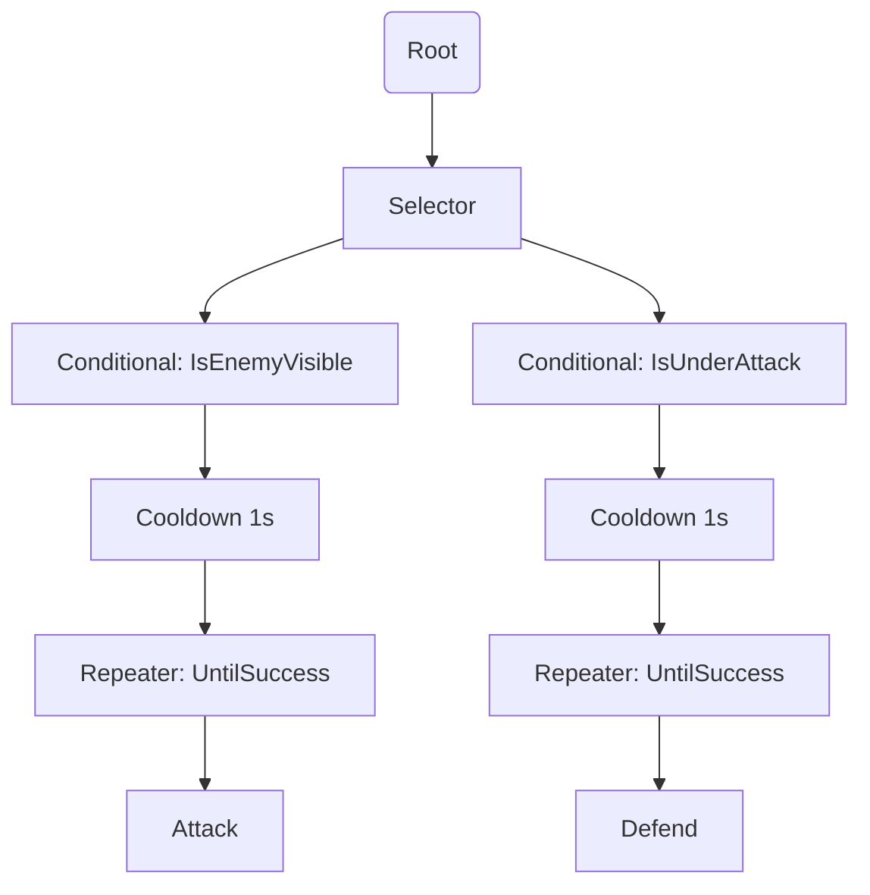
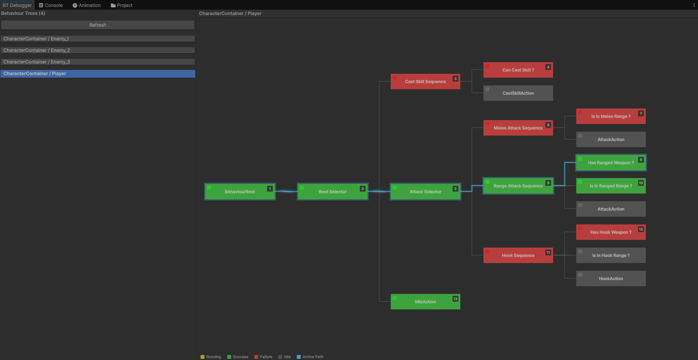
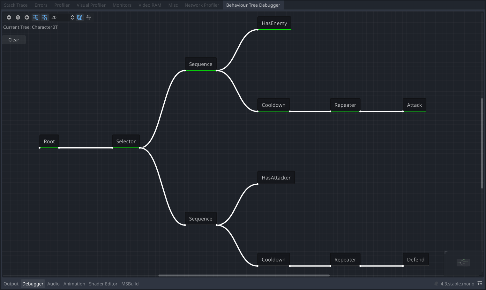

# GroveGames Behaviour Tree

[](https://github.com/grovegs/BehaviourTree/actions/workflows/release.yml)
[](https://github.com/grovegs/BehaviourTree/actions/workflows/tests.yml)
[](https://github.com/grovegs/BehaviourTree/releases/latest)
[](https://www.nuget.org/packages/GroveGames.BehaviourTree)

A modular, allocation-conscious behaviour tree framework for AI development in C#, with first-class **Unity** and **Godot** integrations. Build complex AI behaviours by composing `Composite`, `Decorator`, and custom action nodes with a fluent API.

## Table of Contents

- [Features](#features)
- [Installation](#installation)
  - [.NET](#net)
  - [Unity](#unity)
  - [Godot](#godot)
- [Getting Started](#getting-started)
  - [The Blackboard](#the-blackboard)
  - [Creating Action Nodes](#creating-action-nodes)
  - [Building a Tree](#building-a-tree)
  - [Running the Tree](#running-the-tree)
- [Unity Integration](#unity-integration)
  - [Quick Start](#quick-start)
  - [Dependency Injection](#dependency-injection)
  - [Visual Debugger](#visual-debugger)
- [Godot Integration](#godot-integration)
- [Customization](#customization)
- [Contributing](#contributing)
- [License](#license)

## Features

- **Fluent builder API** — compose trees with chainable extension methods: `Selector`, `Sequence`, `Parallel`, `Conditional`, `Cooldown`, `Delayer`, `Repeater`, `Inverter`, `Succeeder`, `Failer`, `Reset`, `Abort`, `SuccessOnce`.
- **Type-safe blackboard** — strongly typed `BlackboardKey<T>` keys catch type mismatches at compile time; storing value types (`int`, `float`, `Vector3`, …) never boxes.
- **Reusable subtrees** — extract branches into `ChildTree` classes and attach them anywhere.
- **Unity integration** — `BehaviourTreeMono` base component plus an editor **Visual Debugger** window with live node states.
- **Godot integration** — `GodotBehaviourTree` node plus a debugger panel in the Godot editor.
- **AOT friendly** — no reflection or runtime code generation in the core; works with IL2CPP and NativeAOT. Targets `netstandard2.1` and `net10.0`.

## Installation

### .NET

```bash
dotnet add package GroveGames.BehaviourTree
```

### Unity

Add the package via **Package Manager → Add package from git URL**:

```text
https://github.com/grovegs/BehaviourTree.git?path=src/GroveGames.BehaviourTree.Unity/Packages/com.grovegames.behaviourtree
```

Alternatively, download the `.tgz` from the [latest release](https://github.com/grovegs/BehaviourTree/releases/latest) and add it as a local tarball package.

The core library uses modern C# features, so add a `csc.rsp` file to your project's `Assets/` directory:

```text
-langversion:10
-nullable:enable
```

### Godot

```bash
dotnet add package GroveGames.BehaviourTree.Godot
```

## Getting Started

### The Blackboard

The blackboard is a shared data space that nodes use to exchange state. Access is type-safe through `BlackboardKey<T>`: a key carries its value type, so reads and writes are checked at compile time, and value types are stored without boxing.

Define your keys once as static fields:

```csharp
using GroveGames.BehaviourTree.Collections;

public static class BlackboardKeys
{
    public static readonly BlackboardKey<int> Health = new("health");
    public static readonly BlackboardKey<float> DetectionRange = new("detection_range");
    public static readonly BlackboardKey<ITarget> Target = new("target");
}
```

Then read and write values through the keys:

```csharp
var blackboard = new Blackboard();

blackboard.SetValue(BlackboardKeys.Health, 100);
blackboard.SetValue(BlackboardKeys.DetectionRange, 12.5f);

if (blackboard.TryGetValue(BlackboardKeys.Target, out var target))
{
    // use target
}

blackboard.DeleteValue(BlackboardKeys.Target);
blackboard.Clear();
```

### Creating Action Nodes

Inherit from `BehaviourNode` and implement `Evaluate`. Every node can reach the tree's blackboard through the `Blackboard` property:

```csharp
using GroveGames.BehaviourTree.Collections;
using GroveGames.BehaviourTree.Nodes;

public sealed class Attack : BehaviourNode
{
    public Attack(string? name = null) : base(name)
    {
    }

    public override NodeState Evaluate(float deltaTime)
    {
        if (!Blackboard.TryGetValue(BlackboardKeys.Target, out var target))
        {
            return _nodeState = NodeState.Failure;
        }

        // attack the target...
        return _nodeState = NodeState.Running;
    }
}
```

### Building a Tree

Inherit from `BehaviourTree` and override `SetupTree` to describe the structure with the fluent API:

```csharp
using GroveGames.BehaviourTree;
using GroveGames.BehaviourTree.Nodes;
using GroveGames.BehaviourTree.Nodes.Composites;
using GroveGames.BehaviourTree.Nodes.Decorators;

public sealed class CharacterBT : BehaviourTree
{
    public CharacterBT(IRoot root) : base(root)
    {
    }

    public override void SetupTree()
    {
        var selector = Root.Selector();

        selector
            .Conditional(() => IsEnemyVisible())
            .Cooldown(1f)
            .Repeater(RepeatMode.UntilSuccess)
            .Attach(new Attack());

        selector
            .Conditional(() => IsUnderAttack())
            .Cooldown(1f)
            .Repeater(RepeatMode.UntilSuccess)
            .Attach(new Defend());
    }
}
```


```mermaid
graph TD
    Root(Root) --> Selector
    Selector --> Conditional1["Conditional: IsEnemyVisible"]
    Conditional1 --> Cooldown1["Cooldown 1s"]
    Cooldown1 --> Repeater1["Repeater: UntilSuccess"]
    Repeater1 --> Attack
    Selector --> Conditional2["Conditional: IsUnderAttack"]
    Conditional2 --> Cooldown2["Cooldown 1s"]
    Cooldown2 --> Repeater2["Repeater: UntilSuccess"]
    Repeater2 --> Defend
```

### Running the Tree

Create a root with a blackboard, set up the tree, enable it, and tick it from your game loop:

```csharp
var blackboard = new Blackboard();
var tree = new CharacterBT(new BehaviourRoot(blackboard));

tree.SetupTree();
tree.Enable();

// in your game loop:
tree.Tick(deltaTime);

// control at runtime:
tree.Abort();   // abort the running branch
tree.Disable(); // stop evaluating
tree.Reset();   // reset node states
```

## Unity Integration

### Quick Start

Derive from `BehaviourTreeMono`, seed the blackboard, and return your tree from `CreateTree`. The base component creates the blackboard and the tree in `Awake`; you drive ticking:

```csharp
using GroveGames.BehaviourTree;
using GroveGames.BehaviourTree.Collections;
using GroveGames.BehaviourTree.Nodes;
using GroveGames.BehaviourTree.Unity;
using UnityEngine;

public sealed class EnemyBehaviourTree : BehaviourTreeMono
{
    [SerializeField] private Transform _target;
    [SerializeField] private float _detectionRange = 10f;

    protected override BehaviourTree CreateTree(Blackboard blackboard)
    {
        blackboard.SetValue(BlackboardKeys.Target, _target);
        blackboard.SetValue(BlackboardKeys.DetectionRange, _detectionRange);
        blackboard.SetValue(BlackboardKeys.HomePosition, transform.position);

        return new EnemyBT(new BehaviourRoot(blackboard));
    }

    private void Start()
    {
        Tree.SetupTree();
        Tree.Enable();
    }

    private void Update()
    {
        Tree.Tick(Time.deltaTime);
    }

    private void OnDestroy()
    {
        Tree?.Disable();
    }
}
```

```csharp
using GroveGames.BehaviourTree.Collections;
using UnityEngine;

public static class BlackboardKeys
{
    public static readonly BlackboardKey<Transform> Target = new("target");
    public static readonly BlackboardKey<float> DetectionRange = new("detection_range");
    public static readonly BlackboardKey<Vector3> HomePosition = new("home_position");
}
```

### Dependency Injection

For agents that receive their services at runtime, skip the automatic `Awake` setup and build the tree in an `Initialize` method instead. The blackboard doubles as a lightweight service container — reference types are stored in a single lookup, and value types still avoid boxing:

```csharp
using GroveGames.BehaviourTree;
using GroveGames.BehaviourTree.Collections;
using GroveGames.BehaviourTree.Nodes;
using GroveGames.BehaviourTree.Unity;
using UnityEngine;

public sealed class AgentBehaviourTree : BehaviourTreeMono
{
    public void Initialize(IPathfinder pathfinder, ITargetSelector targetSelector, float detectionRange)
    {
        var blackboard = new Blackboard();
        blackboard.SetValue(BlackboardKeys.Pathfinder, pathfinder);
        blackboard.SetValue(BlackboardKeys.TargetSelector, targetSelector);
        blackboard.SetValue(BlackboardKeys.DetectionRange, detectionRange);
        blackboard.SetValue(BlackboardKeys.HomePosition, transform.position);

        _tree = CreateTree(blackboard);
        _tree.SetupTree();
        _tree.Enable();
    }

    protected override BehaviourTree CreateTree(Blackboard blackboard)
    {
        return new AgentBT(new BehaviourRoot(blackboard));
    }

    protected override void Awake()
    {
        // Intentionally empty: the tree is created in Initialize with injected dependencies.
    }

    public void EnableAI()
    {
        _tree?.Enable();
    }

    public void DisableAI()
    {
        _tree?.Abort();
        _tree?.Disable();
    }

    private void Update()
    {
        _tree?.Tick(Time.deltaTime);
    }

    private void OnDestroy()
    {
        _tree?.Disable();
    }
}
```

### Visual Debugger

Open **Tools → GroveGames → Behaviour Tree Debugger** to inspect trees live. In Play Mode the window lists every `BehaviourTreeMono` in the scene by its hierarchy path; selecting one shows the full tree with:

- Node states colored in real time (Running / Success / Failure / Idle)
- The active evaluation path highlighted, with evaluation order numbers
- A scrollable canvas for large trees and a resizable tree list panel



## Godot Integration

Derive your tree from `GodotBehaviourTree` (a `Godot.Node`), set a root, and tick it from `_Process`:

```csharp
public partial class Character : Godot.Node
{
    private CharacterBT _characterBT;

    public override void _Ready()
    {
        _characterBT = new CharacterBT();
        _characterBT.SetRoot(new BehaviourRoot(new Blackboard()));
        _characterBT.SetupTree();
        _characterBT.Enable();
        AddChild(_characterBT);
    }

    public override void _Process(double delta)
    {
        _characterBT.Tick((float)delta);
    }
}
```

With the addon enabled, node states are displayed under the editor's **Debugger** tab so you can track the tree's evaluation frame by frame.



## Customization

Extend the framework by creating custom nodes:

- **Action nodes**: inherit from `BehaviourNode` and implement the behaviour in `Evaluate`.
- **Decorator nodes**: inherit from `Decorator` to modify the behaviour of a single child.
- **Composite nodes**: inherit from `Composite` to define logic over multiple children.

### Example: Custom Decorator

A `TimeLimit` decorator that fails its child if it runs longer than a given duration:

```csharp
using GroveGames.BehaviourTree.Nodes;
using GroveGames.BehaviourTree.Nodes.Decorators;

public sealed class TimeLimit : Decorator
{
    private readonly float _maxDuration;
    private float _elapsed;

    public TimeLimit(float maxDuration, string? name = null) : base(name)
    {
        _maxDuration = maxDuration;
    }

    public override NodeState Evaluate(float deltaTime)
    {
        _elapsed += deltaTime;

        if (_elapsed >= _maxDuration)
        {
            _elapsed = 0f;
            return _nodeState = NodeState.Failure;
        }

        return _nodeState = base.Evaluate(deltaTime);
    }

    public override void Reset()
    {
        base.Reset();
        _elapsed = 0f;
    }
}
```

## Contributing

Contributions are welcome! To contribute:

1. Fork the repository.
2. Create a new branch (`git checkout -b feature/your-feature`).
3. Commit your changes (`git commit -am 'Add new feature'`).
4. Push the branch (`git push origin feature/your-feature`).
5. Open a Pull Request.

## License

This project is licensed under the MIT License - see the [LICENSE](LICENSE) file for details.
